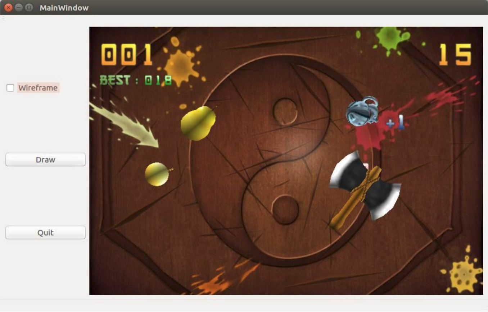

# Fruit_Samurai_Project
Mini Game Project using Webcam @CPELyon 2016 
Authors: Prince Ngattai Lam / Lucas Maigre / Camille Farineau 
C++ project using OpenGL 

This C++ project was developped in team in 4th year of engineering school at CPE Lyon. 
It is based on OpenGL. 
 
It it based on the original idea of the smartphone game Fruit Ninja.
This version is using the webcam to interact with the game.
The player controls a sword in order to slice the fruits that appears on the screen while being attentive to bombs.

To control the sword, the player need to use a controller: the controller can be a stick with a red ball at the top.
In order to detect correctly the controller the player needs to initialize the detection of the controller by clicking at the beginning of the game of the point of interest of his controller.

Please read the full report [PDF](ReadMe/CR_FruitNinjaGame_Farineau_MaigreNgattaiLam.pdf). NOTE: It is a french ReadMe.

